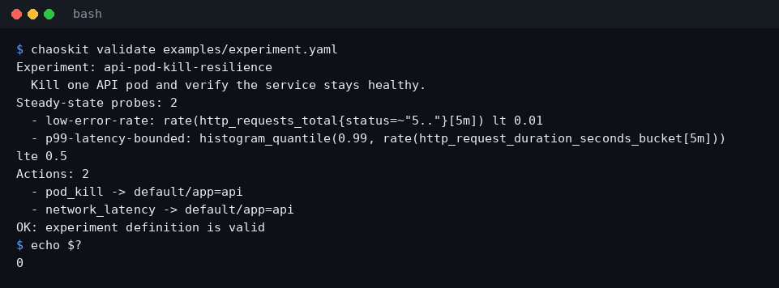
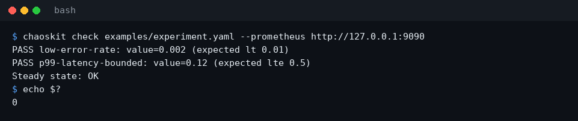
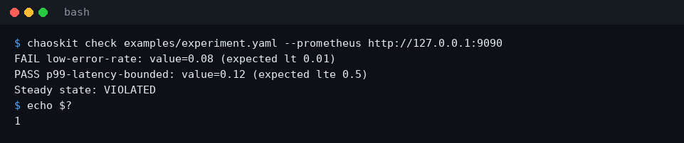
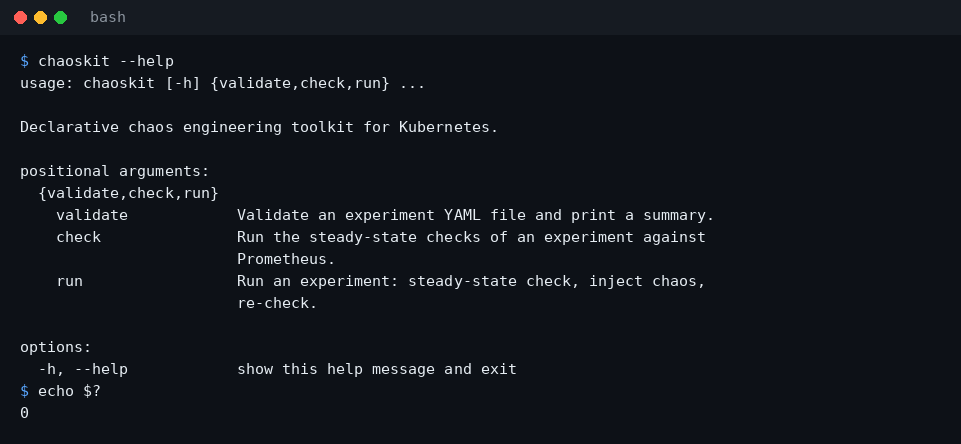
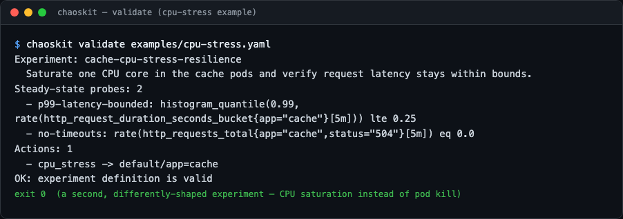
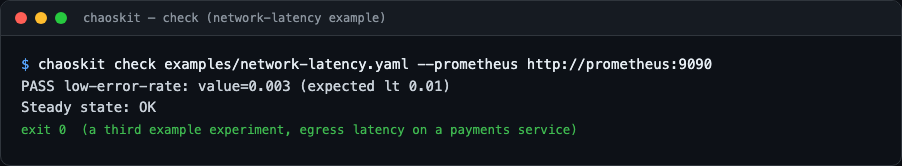

# chaos-kit

A declarative chaos engineering toolkit for Kubernetes.

Define resilience experiments in YAML — pod kills, CPU stress, network
latency — and chaos-kit injects them, verifies your steady-state hypothesis
against Prometheus before and after, and produces a pass/fail resilience
report.

## Preview

Real CLI output (a stubbed Prometheus backend standing in for a live one,
same pattern the test suite uses):



<details>
<summary>More views</summary>











</details>

## Project Status

**Active development** — built in public, nightly progress.
See [PROGRESS.md](PROGRESS.md) for the vision, architecture, phased build
plan, and exactly where the build currently stands.

Current state: **Phase 3 complete** — experiment schema, steady-state
verification against Prometheus, Kubernetes chaos injectors (`pod_kill`,
`cpu_stress`, `network_latency`), an experiment runner, pass/fail
resilience reports (text and JSON), and a CLI (`validate`, `check`,
`run`), fully tested.

## Experiment format

```yaml
name: api-pod-kill-resilience
description: Kill one API pod and verify the service stays healthy.

steady_state:
  - name: low-error-rate
    query: rate(http_requests_total{status=~"5.."}[5m])
    operator: lt
    threshold: 0.01

actions:
  - type: pod_kill
    target:
      namespace: default
      label_selector: app=api
    params:
      count: 1
```

See [examples/experiment.yaml](examples/experiment.yaml) for a full
example. More ready-to-adapt experiments live in the
[examples gallery](examples/):

- [examples/experiment.yaml](examples/experiment.yaml) — pod kill plus
  network latency against an API service
- [examples/cpu-stress.yaml](examples/cpu-stress.yaml) — CPU saturation
  on cache pods
- [examples/network-latency.yaml](examples/network-latency.yaml) —
  egress latency on a payments service

## Usage

```bash
# Validate an experiment definition
chaoskit validate examples/experiment.yaml

# Check the steady-state hypothesis against Prometheus
chaoskit check examples/experiment.yaml --prometheus http://localhost:9090

# Run the full experiment: steady-state check, inject chaos, settle, re-check
chaoskit run examples/experiment.yaml --prometheus http://localhost:9090

# Same, but emit the resilience report as JSON
chaoskit run examples/experiment.yaml --prometheus http://localhost:9090 --json
```

## Resilience reports

`chaoskit run` ends with a pass/fail resilience report covering the
verdict, pre/post steady-state probes, every injected action, and
wall-clock timing (total duration and recovery time):

```
chaos-kit resilience report
===========================
Experiment: api-pod-kill-resilience
  Kill one API pod and verify the service stays healthy.
Started:  2026-08-11T08:07:18Z
Duration: 10.42s (recovery: 10.02s)

Pre-injection steady state:
  PASS low-error-rate: value=0.001 (expected lt 0.01)
  PASS p99-latency-bounded: value=0.12 (expected lte 0.5)

Injected chaos:
  - pod_kill -> default/app=api: deleted 1 pod(s): api-6d9f8c7b5-x2abc (at 2026-08-11T08:07:18Z)
  - network_latency -> default/app=api: added 100ms latency for 30s in 1 pod(s): api-6d9f8c7b5-y7def (at 2026-08-11T08:07:19Z)

Post-injection steady state:
  PASS low-error-rate: value=0.002 (expected lt 0.01)
  PASS p99-latency-bounded: value=0.15 (expected lte 0.5)

Verdict: experiment PASSED
```

With `--json` the same report is emitted as machine-readable JSON
(verdict, probe values, injections, and timings) for CI pipelines and
dashboards. Exit codes: `0` passed, `1` failed or aborted, `2`
setup/validation error.

## Chaos actions

| Action | Effect | Params (defaults) |
| --- | --- | --- |
| `pod_kill` | Deletes pods matching the target selector | `count` (1) |
| `cpu_stress` | Runs `stress-ng` inside matching pods | `cores` (1), `duration` (30s) |
| `network_latency` | Adds egress latency via `tc`/netem, self-cleaning | `latency_ms` (100), `duration` (30s) |

Actions target pods via `target.namespace` and `target.label_selector`.
`cpu_stress` needs `stress-ng` in the container image; `network_latency`
needs `tc` (iproute2) and the `NET_ADMIN` capability.

`chaoskit run` requires a kubeconfig (or in-cluster config) and the optional
`kubernetes` Python package (`pip install kubernetes`). It verifies the
steady-state hypothesis first and aborts without injecting anything if the
system is already unhealthy.

## Development

```bash
python3 -m venv .venv
.venv/bin/pip install -e ".[dev]"
.venv/bin/python -m pytest
```

## License

MIT
